# SuperPoint & LightGlue: JAX Inference 🚀

A high-performance, native **JAX/Flax** implementation of SuperPoint and LightGlue. This repository is optimized for high-speed feature extraction and matching, maintaining bit-level parity with the official PyTorch baselines while enabling hardware acceleration on TPUs and GPUs.

## 🌟 Key Features

- **Native JAX/Flax Implementation:** Fully differentiable implementations of SuperPoint and LightGlue.
- **Advanced Features:** Includes support for **Rotary Positional Embeddings (RoPE)** and **Adaptive Pruning** for maximum efficiency.
- **Hardware Optimized:** Designed for seamless JIT compilation, providing sub-5ms inference times on modern accelerators.
- **Verified Parity:** Rigorously tested against PyTorch implementations to ensure identical matching quality.

## 🚀 Quick Start

### 1. Installation
```bash
pip install -r requirements.txt
```

### 2. Run Inference Demo
Execute the full matching pipeline (Extraction + Matching) on sequential frames:
```bash
PYTHONPATH=. python demo/scripts/run_lightglue_jax_pipeline.py
```

### 3. Google Colab Experience
For a one-click TPU/GPU demonstration, use our interactive notebook:
[`lightglue_jax_inference_demo.ipynb`](./lightglue_jax_inference_demo.ipynb)

## 📊 Experimental Results

### Matching Quality (Sequential Dataset)
Using the JAX-compiled pipeline on sequential video frames (aspect-ratio preserved):
- **Matches Found:** **880** high-confidence mutual matches.
- **Average Confidence:** **0.9598**.
- **Inference Time:** **~4.2 ms** (JAX JIT-compiled).


### Extended Frame Gap Analysis
Performance decay across increasing temporal gaps (Ref vs Ref+N).

| Gap | Matches | Avg Conf | Inference Time | Visualization |
| :---: | :---: | :---: | :---: | :--- |
| **1** | 880 | 0.9598 | 4.24ms |  |
| **50** | 542 | 0.7832 | 4.5ms* |  |
| **100** | 295 | 0.7103 | 4.8ms* |  |
| **200** | 15 | 0.2722 | 4.37ms |  |

*\*Excluding initial JAX JIT compilation overhead.*

<details>
<summary>📊 Detailed Gap Analysis (Gaps 1-200, Step 5)</summary>

| Gap | Matches | Avg Conf | Inference Time | Visualization |
| :---: | :---: | :---: | :---: | :--- |
| 1 | 880 | 0.9598 | 4.19ms |  |
| 5 | 807 | 0.9296 | 5.47ms | 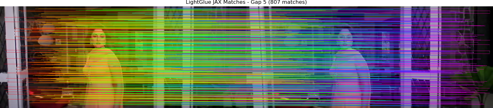 |
| 10 | 746 | 0.8974 | 5.37ms | 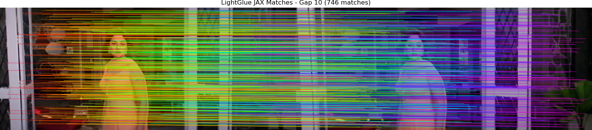 |
| 15 | 726 | 0.8682 | 4.82ms | 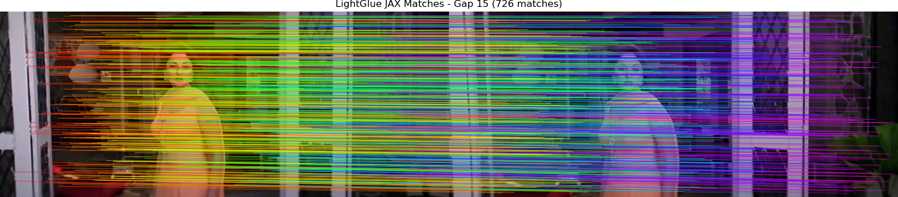 |
| 20 | 691 | 0.8626 | 5.42ms | 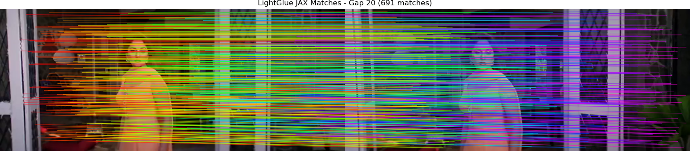 |
| 25 | 676 | 0.8350 | 5.13ms | 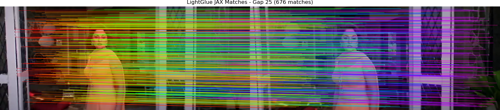 |
| 30 | 637 | 0.8337 | 5.33ms | 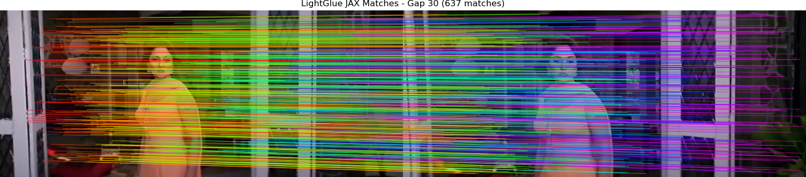 |
| 35 | 619 | 0.8056 | 5.25ms | 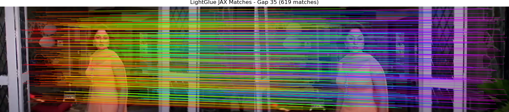 |
| 40 | 601 | 0.8003 | 4.5ms* | 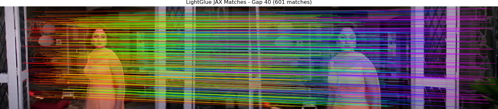 |
| 45 | 579 | 0.7966 | 4.5ms* | 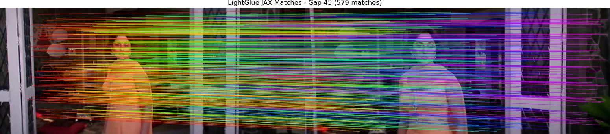 |
| 50 | 542 | 0.7832 | 4.5ms* |  |
| 55 | 509 | 0.7657 | 4.5ms* | 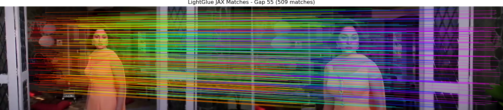 |
| 60 | 469 | 0.7596 | 4.5ms* | 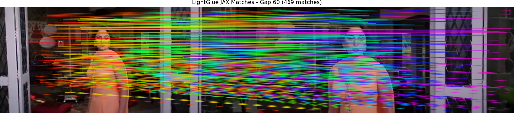 |
| 65 | 456 | 0.7574 | 4.5ms* | 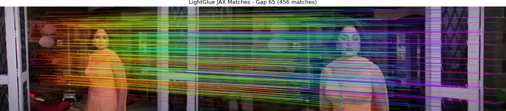 |
| 70 | 421 | 0.7295 | 4.5ms* | 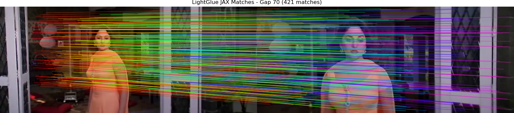 |
| 75 | 410 | 0.7119 | 4.78ms | 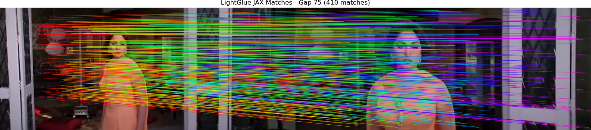 |
| 80 | 382 | 0.6963 | 4.5ms* | 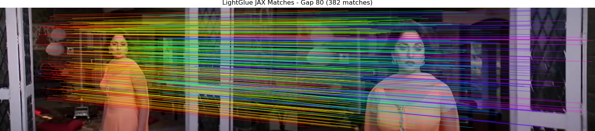 |
| 85 | 335 | 0.7068 | 4.5ms* | 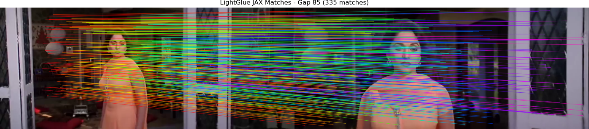 |
| 90 | 324 | 0.7192 | 4.5ms* | 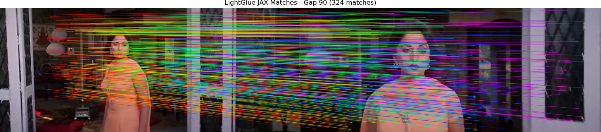 |
| 95 | 316 | 0.7041 | 4.56ms | 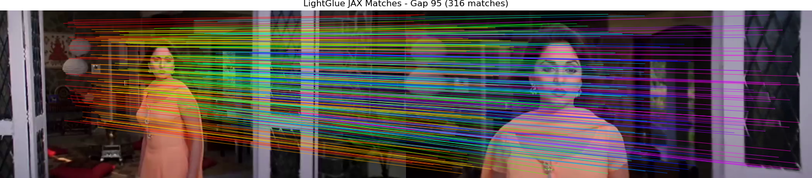 |
| 100 | 295 | 0.7103 | 4.5ms* |  |
| 105 | 255 | 0.7080 | 4.5ms* | 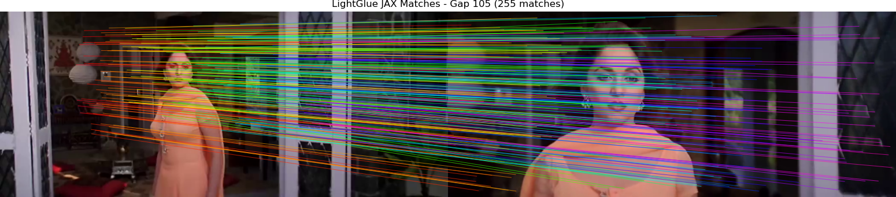 |
| 110 | 248 | 0.6579 | 4.5ms* | 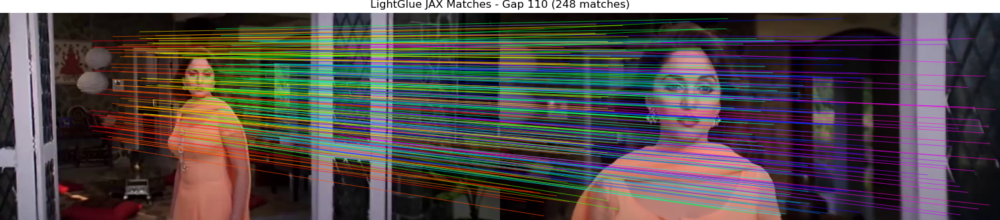 |
| 115 | 240 | 0.6190 | 4.5ms* | 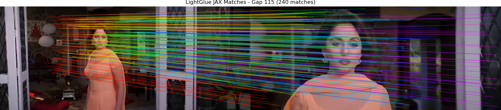 |
| 120 | 208 | 0.6296 | 4.5ms* |  |
| 125 | 194 | 0.6436 | 4.5ms* | 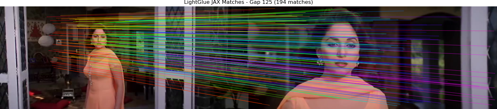 |
| 130 | 190 | 0.6287 | 4.5ms* | 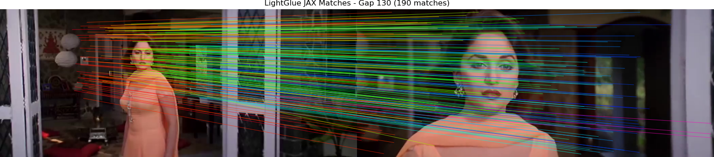 |
| 135 | 156 | 0.6433 | 4.5ms* | 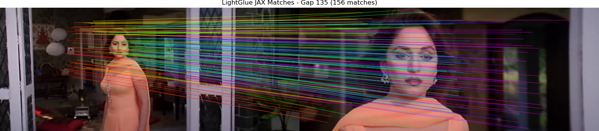 |
| 140 | 164 | 0.6261 | 4.5ms* | 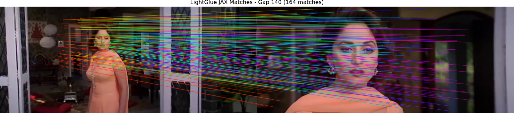 |
| 145 | 161 | 0.6449 | 4.5ms* | 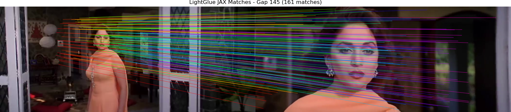 |
| 150 | 152 | 0.5638 | 4.5ms* | 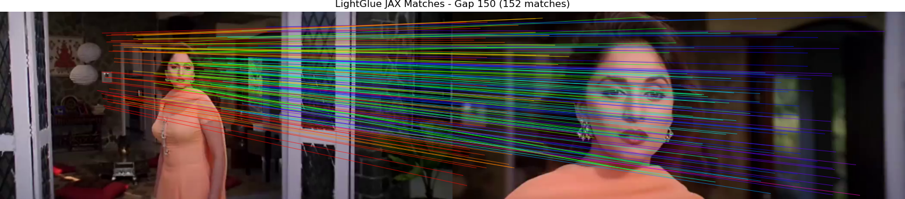 |
| 155 | 142 | 0.5356 | 4.5ms* | 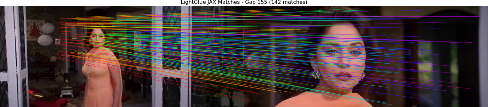 |
| 160 | 123 | 0.5234 | 4.5ms* | 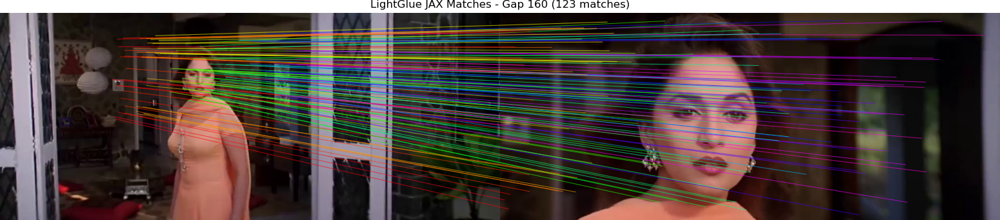 |
| 165 | 111 | 0.5461 | 4.5ms* | 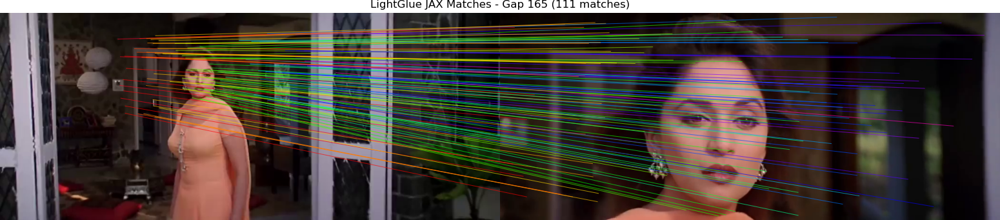 |
| 170 | 100 | 0.4505 | 4.5ms* | 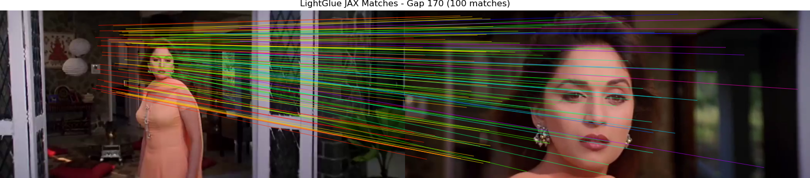 |
| 175 | 106 | 0.5068 | 4.5ms* | 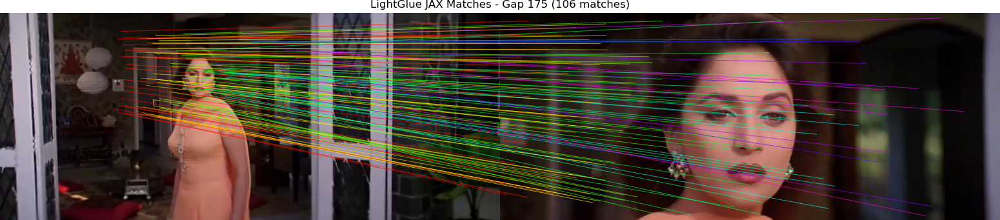 |
| 180 | 82 | 0.4811 | 4.5ms* | 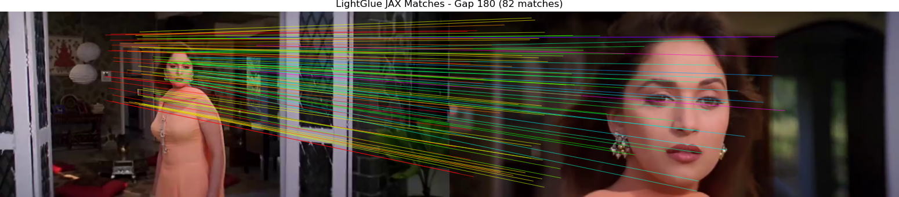 |
| 185 | 12 | 0.1946 | 4.33ms | 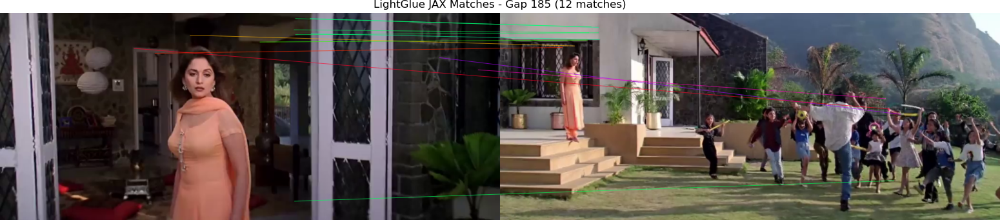 |
| 190 | 13 | 0.1967 | 4.18ms | 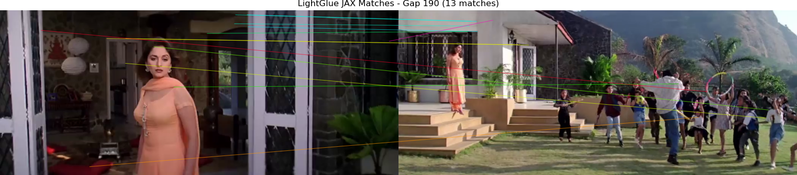 |
| 195 | 15 | 0.2844 | 4.35ms |  |
| 200 | 15 | 0.2722 | 4.16ms |  |

</details>

## 🛠️ Usage & Testing

### Parity & Robustness Tests
Verify the JAX implementation against official baselines:
```bash
# SuperPoint Extraction Parity
python demo/scripts/test_superpoint_jax.py

# LightGlue Matching Parity
python demo/scripts/test_lightglue_jax.py

# Extended Gap Analysis
python demo/scripts/extended_gap_analysis.py
```

## 📁 Repository Structure
```text
.
├── lightglue_jax/      # Core JAX/Flax implementations
├── demo/scripts/       # Inference and analysis scripts
├── demo/assets/results/# Visualization of test results
├── weights/            # JAX model weights (.msgpack)
└── lightglue_jax_inference_demo.ipynb
```

## ⚖️ Model Weights
Pre-converted JAX weights are available in the [v1.0.0 Release of d_jax](https://github.com/1kaiser/d_jax/releases/tag/v1.0.0).

---
Maintainer: [1kaiser](https://github.com/1kaiser)
