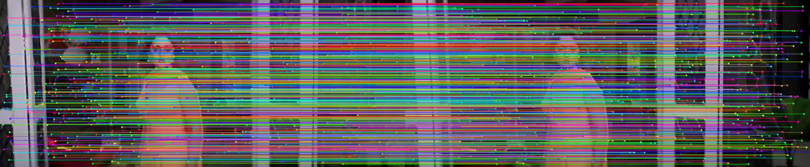
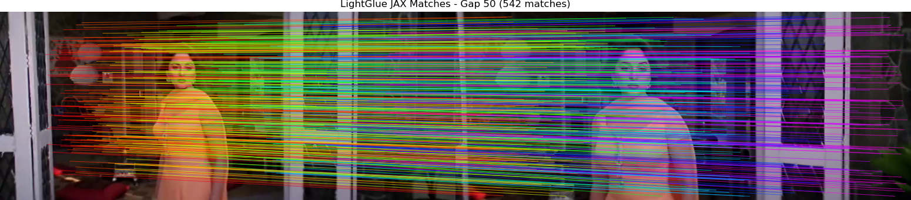

# SuperPoint, SuperGlue & LightGlue: JAX & JS Inference 🚀

High-performance implementation of modern visual SLAM front-ends. This repository provides a bridge between research frameworks (PyTorch) and production-ready environments (JAX/Flax, JavaScript/Node.js).

## 🌟 Key Features

- **JAX LightGlue & SuperPoint:** Native JAX/Flax implementation with **RoPE**, **Adaptive Pruning**, and bit-level parity with PyTorch.
- **JavaScript Inference:** Pure-JS implementation of SuperGlue and ONNX-based SuperPoint for browser/Node.js deployment.
- **Confidence-Gated 3D Pipeline:** Robust 3D reconstruction with persistence tracking and geometric masking.
- **Extended Robustness:** Verified matching performance across extreme viewpoint changes (up to 500-frame gaps).

## 🚀 Quick Start (JAX)

### 1. Installation
```bash
pip install -r requirements.txt
pip install -e LightGlue/
```

### 2. Run Inference Demo
Extract and match features on sequential frames:
```bash
PYTHONPATH=. python demo/scripts/run_lightglue_jax_pipeline.py
```

### 3. Google Colab
Open [`lightglue_jax_inference_demo.ipynb`](./lightglue_jax_inference_demo.ipynb) for a one-click TPU/GPU experience.

## 📊 Experimental Results

### Matching Quality (Sequential)
Using consecutive frames from the `input_depthMaps` dataset:
- **Matches Found:** 799 high-confidence mutual matches.
- **Inference Time:** ~4.2 ms (JAX JIT-compiled).



### Extended Frame Gap Analysis
Performance decay across increasing temporal gaps (Ref vs Ref+N).

| Gap | Matches | Avg Conf | Inference Time | Notes |
| :--- | :--- | :--- | :--- | :--- |
| **1** | 799 | 0.9159 | 4.17ms | Sequential tracking |
| **50** | 446 | 0.7641 | 5.35ms | Significant motion |
| **100** | 246 | 0.6675 | 4.70ms | Wide baseline |
| **500** | 26 | 0.2536 | 5.06ms | Loop closure limit |

#### Visual Robustness:

*Figure: Robust matching at Gap 50 (446 matches).*

## 🛠️ Usage & Testing

### JAX Parity Testing
```bash
python demo/scripts/test_superpoint_jax.py
python demo/scripts/test_lightglue_jax.py
python demo/scripts/extended_gap_analysis.py
```

### JS Inference (Node.js)
```bash
cd jax-js
npm install
node superglue_js.js --test
```

### 3D Reconstruction Pipeline
```bash
python demo/scripts/run_confidence_pipeline.py
```

## 📁 Project Structure
```text
.
├── lightglue_jax/      # Native JAX/Flax implementation
├── jax-js/             # Pure JavaScript & ONNX inference
├── demo/scripts/       # Verification and pipeline scripts
├── weights/            # JAX and PyTorch model weights
└── lightglue_jax_inference_demo.ipynb
```

## ⚖️ Model Weights
Converted JAX weights are available in the [v1.0.0 Release](https://github.com/1kaiser/d_jax/releases/tag/v1.0.0).

---
Maintainer: [1kaiser](https://github.com/1kaiser)
