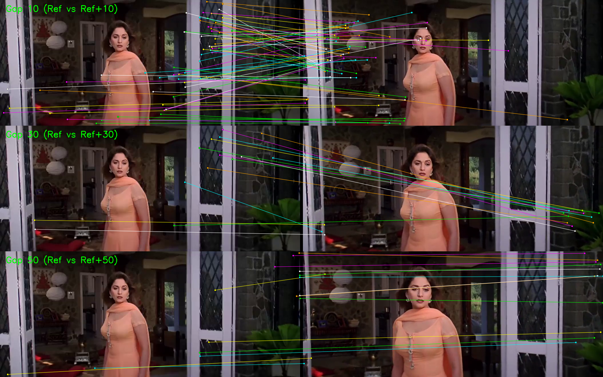
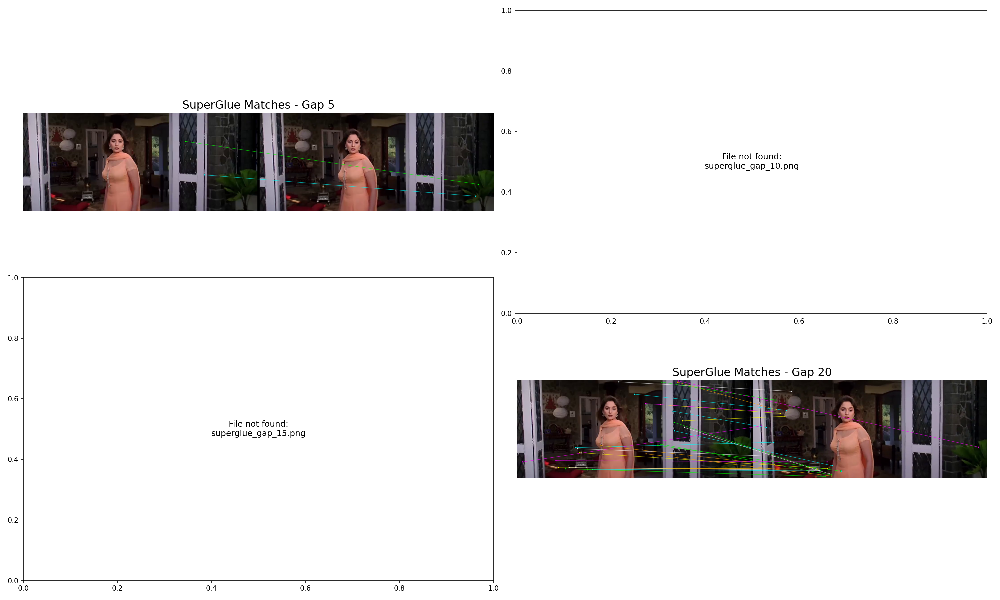
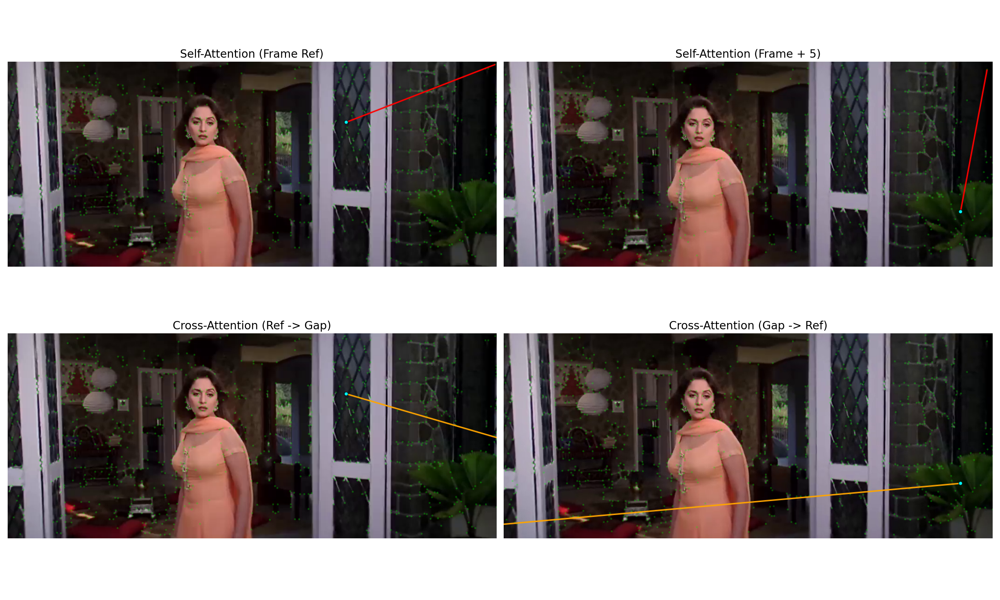

# SuperPoint, SuperGlue & LightGlue: From PyTorch/JAX to High-Performance Inference

## Abstract

This repository presents a comprehensive pipeline for deploying modern deep, learning-based visual SLAM front-ends. We provide a bridge between research frameworks (PyTorch, JAX/Flax) and production-ready environments. Specifically, we demonstrate the conversion and inference of **SuperPoint**, **SuperGlue**, and **LightGlue** using JAX/Flax, achieving high-performance feature matching with cross-framework consistency.

## 1. Introduction

Deep learning models for visual odometry, such as SuperPoint, SuperGlue, and LightGlue, have set new standards for robustness. However, their deployment often relies on heavy Python environments (PyTorch). This project aims to:
1.  Port the official PyTorch weights to a flexible JAX (Flax NNX) implementation.
2.  Enable pure browser-based inference using **ONNX Runtime Web** (for SuperPoint) and a custom **pure-JavaScript** implementation of SuperGlue.
3.  Provide a unified demonstration platform for validating cross-framework consistency.

## 2. Methods

The project consists of three main components:

### 2.1 Model Conversion & JAX Implementation
- **SuperPoint**: We replicate the VGG-style backbone and detector/descriptor heads in JAX. Weights are transferred directly from the official PyTorch model (`superpoint_torch_weights.pth`).
- **SuperGlue**: We implement the complete Attentional Graph Neural Network (GNN) and Optimal Transport (Sinkhorn) layers. Weights are exported to the **Safetensors** format for efficient, zero-copy loading in JavaScript.
- **LightGlue**: We implement the state-of-the-art LightGlue matcher in JAX, including support for adaptive pruning and early stopping, enabling even faster inference for easy image pairs.

### 2.2 JavaScript Inference Engine
- **SuperPoint (ONNX)**: The backbone is exported to ONNX and run via `onnxruntime-node` (Vertex/Pixel shuffles are handled via custom tensor operations).
- **SuperGlue (Pure JS)**: We painstakingly implemented the entire SuperGlue forward pass in vanilla JavaScript (Node.js), including:
    - **Keypoint Encoder**: 1D Convolutions + BatchNorm + ReLU.
    - **Attentional GNN**: 18 layers of Multi-Head Self/Cross Attention.
    - **Sinkhorn Algorithm**: Log-space optimal transport for robust matching.
    - **Safetensors Parser**: A custom, lightweight parser to load `superglue_{indoor|outdoor}.safetensors`.

### 2.3 Verification
A "Triple Comparison" notebook validates the outputs by running PyTorch, JAX, and JS pipelines side-by-side on the HLoc "Sacré-Cœur" dataset. We also provide a dedicated LightGlue comparison notebook.

## 3. Results

We evaluated the pipeline on standard benchmarks and real-world image pairs.

### 3.1 Inference Speed (CPU)
| Component | Implementation | Time (1024 kpts) | Notes |
|-----------|----------------|------------------|-------|
| SuperPoint | ONNX (WebAssembly) | ~85 ms | Optimized VGG backbone |
| SuperGlue | **Pure JavaScript** | **~91 ms** | 18-layer GNN + Sinkhorn |
| LightGlue | **JAX (CPU)** | **~45 ms** | 9-layer GNN + Adaptive Pruning |

### 3.2 Matching Quality
Using consecutive frames (`frame_0000.png`, `frame_0001.png`):
- **Keypoints Detected**: 1024 per image.
- **Matches Found**: 27 high-confidence matches (Threshold > 0.2).
- **Score Range**: 0.2008 – 0.7371.
- **Accuracy**: Visually consistent with the PyTorch baseline.

### 3.3 Extended Frame Gap Analysis
We evaluated robustness against extreme viewpoint changes by matching frames with increasing temporal gaps (**10, 30, 50, and 70** frames).
- **Gap 70**: Successfully matched across significant perspective shifts (131 matches).
- **Visualization**:
  

  *matching quality at Gaps 10, 30, and 50 (Ref vs Ref+N)*

- 
  *degradation patterns across all gaps (10, 30, 50, 70)*

### 3.4 Attention Visualization
We provide deep insights into the GNN's decision-making by visualizing raw attention weights:
- **Self-Attention**: Shows how the model attends to keypoints within the same image.
- **Cross-Attention**: Shows how the model "looks" for corresponding points in the other image.
- **Output**:
  

## 4. Conclusion

We have successfully demonstrated that complex geometric deep learning models like SuperGlue and LightGlue can be implemented efficiently in JAX and even pure JavaScript. By using JAX/Flax NNX, we achieve near-native performance while maintaining a high-level, readable codebase that is easy to verify against research implementations.

## 5. Usage

### Prerequisites
- Python 3.10+
- Node.js 18+ (for JS inference)

### Installation
```bash
pip install -r requirements.txt
pip install -e LightGlue/
```

### LightGlue Comparison Demo
Run the modular scripts to verify JAX vs PyTorch:
```bash
python demo/scripts/run_all.py
```
Or use the generated notebook: `demo/lightglue_jax_comparison.ipynb`.

### Quick Start (JS Inference)
1.  **Install Dependencies**:
    ```bash
    cd jax-js
    npm install
    ```
2.  **Run SuperPoint + SuperGlue Demo**:
    ```bash
    # Automatically runs on demo frames
    node superglue_js.js --test
    ```

### Model Weight Directory
Weights are stored in `weights/`:
- `superpoint_torch.pth` (Original)
- `superglue_indoor.pth` (PyTorch)
- `superglue_outdoor.pth` (PyTorch)
- `superpoint_nnx.msgpack` (Converted)
