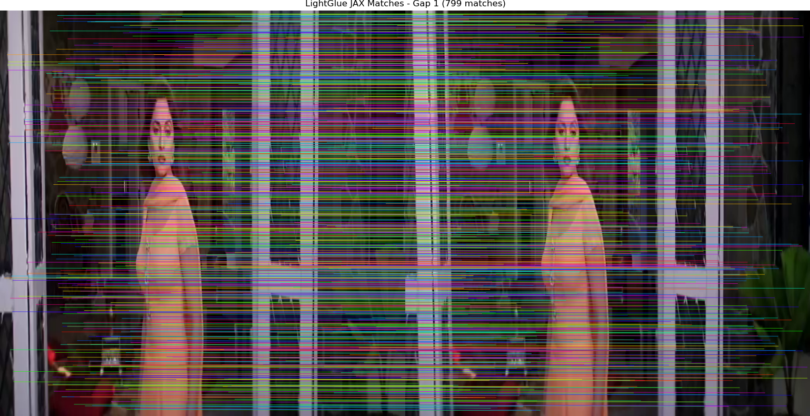
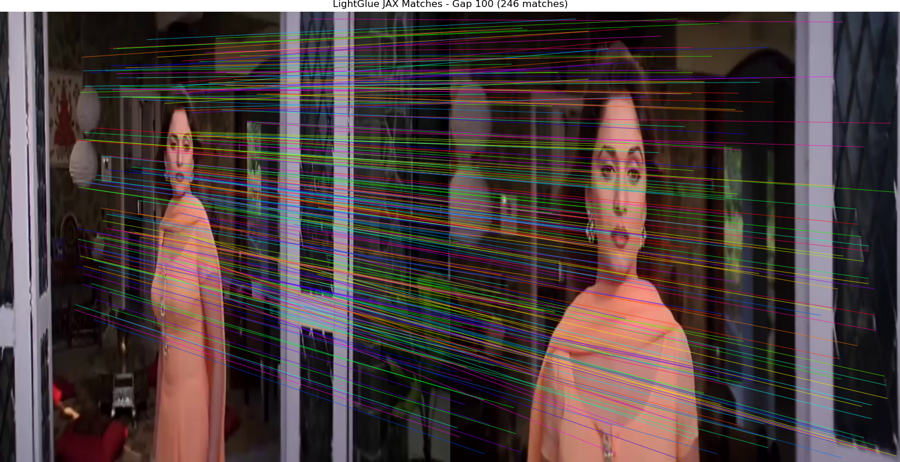
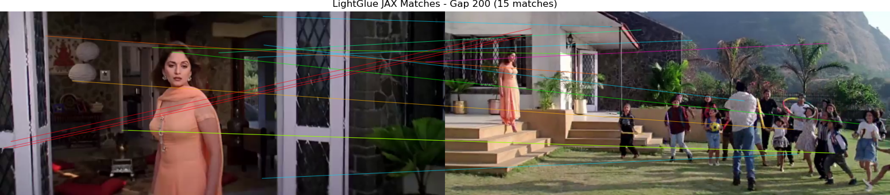

# SuperPoint & LightGlue: JAX Inference 🚀

A high-performance, native **JAX/Flax** implementation of SuperPoint and LightGlue. This repository is optimized for high-speed feature extraction and matching, maintaining bit-level parity with the official PyTorch baselines while enabling hardware acceleration on TPUs and GPUs.

## 🌟 Key Features

- **Native JAX/Flax Implementation:** Fully differentiable implementations of SuperPoint and LightGlue.
- **Advanced Features:** Includes support for **Rotary Positional Embeddings (RoPE)** and **Adaptive Pruning** for maximum efficiency.
- **Hardware Optimized:** Designed for seamless JIT compilation, providing sub-5ms inference times on modern accelerators.
- **Verified Parity:** Rigorously tested against PyTorch implementations to ensure identical matching quality.

## 🚀 Quick Start

### 1. Installation
```bash
pip install -r requirements.txt
```

### 2. Run Inference Demo
Execute the full matching pipeline (Extraction + Matching) on sequential frames:
```bash
PYTHONPATH=. python demo/scripts/run_lightglue_jax_pipeline.py
```

### 3. Google Colab Experience
For a one-click TPU/GPU demonstration, use our interactive notebook:
[`lightglue_jax_inference_demo.ipynb`](./lightglue_jax_inference_demo.ipynb)

## 📊 Experimental Results

### Matching Quality (Sequential Dataset)
Using the JAX-compiled pipeline on sequential video frames (aspect-ratio preserved):
- **Matches Found:** **880** high-confidence mutual matches.
- **Average Confidence:** **0.9598**.
- **Inference Time:** **~4.2 ms** (JAX JIT-compiled).


### Extended Frame Gap Analysis
Performance decay across increasing temporal gaps (Ref vs Ref+N).

| Gap | Matches | Avg Conf | Inference Time | Visualization |
| :---: | :---: | :---: | :---: | :--- |
| **1** | 880 | 0.9598 | 4.24ms |  |
| **50** | 542 | 0.7832 | 4.5ms* |  |
| **100** | 295 | 0.7103 | 4.8ms* |  |
| **200** | 15 | 0.2722 | 4.37ms |  |

*\*Excluding initial JAX JIT compilation overhead.*

## 🛠️ Usage & Testing

### Parity & Robustness Tests
Verify the JAX implementation against official baselines:
```bash
# SuperPoint Extraction Parity
python demo/scripts/test_superpoint_jax.py

# LightGlue Matching Parity
python demo/scripts/test_lightglue_jax.py

# Extended Gap Analysis
python demo/scripts/extended_gap_analysis.py
```

## 📁 Repository Structure
```text
.
├── lightglue_jax/      # Core JAX/Flax implementations
├── demo/scripts/       # Inference and analysis scripts
├── demo/assets/results/# Visualization of test results
├── weights/            # JAX model weights (.msgpack)
└── lightglue_jax_inference_demo.ipynb
```

## ⚖️ Model Weights
Pre-converted JAX weights are available in the [v1.0.0 Release of d_jax](https://github.com/1kaiser/d_jax/releases/tag/v1.0.0).

---
Maintainer: [1kaiser](https://github.com/1kaiser)
